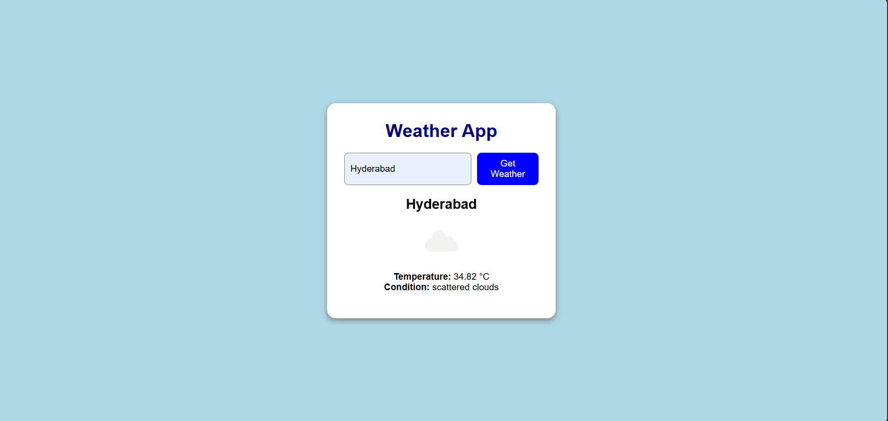

# 🌦️ Weather App

A simple and responsive Weather App built using **HTML**, **CSS**, and **JavaScript**, that allows users to fetch and view current weather conditions for any city using the OpenWeatherMap API.

---

## 📸 Preview



---

## 🚀 Features

- 🌍 Search weather by city name
- 🌡️ Displays current temperature in Celsius
- ☁️ Shows weather description (e.g., Sunny, Rainy)
- 🖼️ Displays weather icon based on current condition
- ❌ Error handling for invalid city names or API issues
- 💻 Fully responsive design using plain CSS

---

## 🛠️ Technologies Used

- **HTML** – Structure of the app  
- **CSS** – Styling and layout  
- **JavaScript** – Logic and API integration  
- **[OpenWeatherMap API](https://openweathermap.org/api)** – For real-time weather data

---

## 🔧 How to Use

1. **Clone this repository**
   ```bash
   git clone https://github.com/manasranjanbarik1010/weather-app.git
   cd weather-app

2. Open index.html in your browser
    Just double-click the file or use Live Server (if using VS Code).

3. Enter a city name and click "Get Weather"
    Weather data will be displayed including temperature, description, and icon.

 🔑 API Key Setup
    This project uses the OpenWeatherMap API. You need to get your own API key:

   1. Go to https://openweathermap.org/api

   2. Sign up and log in

   3. Get your API key from the dashboard

   4. Replace the placeholder API key in script.js:
      const apiKey = "YOUR_API_KEY_HERE";

📁 Project Structure

weather-app/
│
├── index.html           # HTML structure
├── style.css            # CSS styling
├── script.js            # JavaScript logic & API fetch
├── README.md            # Project overview and usage instructions
├── .gitignore           # Git ignored files (like node_modules, API keys if used)
└── assets/              # (Optional) Images, screenshots, icons

📌 License
This project is open source and free to use. Attribution appreciated. 😊

🙌 Acknowledgements
OpenWeatherMap for providing the free weather API

👨‍💻 Developed By
Manas Ranjan Barik
(GitHub: https://github.com/manasranjanbarik1010)


